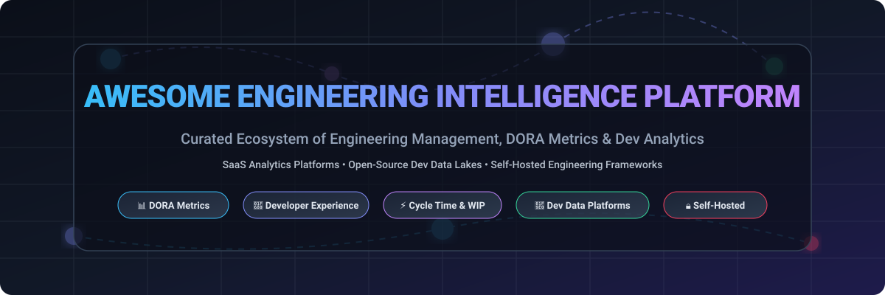

<!-- SEO Metadata & Overview -->
<!-- Keywords: Engineering Intelligence, Developer Productivity, Developer Experience, DORA Metrics, Value Stream Management, Software Engineering Analytics, Self-Hosted Dev Data Lake, DevEx, SPACE Framework -->

<p align="center">
  <a href="https://github.com/ishandutta2007/Awesome-Awesome-Awesome"></a>
  <a href="https://discord.gg/jc4xtF58Ve"></a>
  <a href="https://github.com/ishandutta2007/Awesome-Engineering-Intelligence-Platform/stargazers"></a>
  <a href="https://github.com/ishandutta2007/Awesome-Engineering-Intelligence-Platform/network/members"></a>
  <a href="https://github.com/ishandutta2007/Awesome-Engineering-Intelligence-Platform/blob/main/LICENSE"></a>
  <a href="https://github.com/ishandutta2007"></a>
</p>

<p align="center">
  
</p>

# 🧠 Awesome Engineering Intelligence Platform Ecosystem 🚀

> **Curated Directory of SaaS Products, Hosted Solutions & Open-Source GitHub Projects**  
> *Focused on Engineering Intelligence, Developer Productivity, Developer Experience (DevEx), DORA Metrics, Software Engineering Analytics, Value Stream Management (VSM) & Engineering Management.*

**Last updated: September 2026** 📅

---

## 📌 Introduction & Architecture Overview

This repository tracks notable **SaaS/Hosted platforms** and **open-source GitHub projects** for **Engineering Intelligence**.

Engineering Intelligence platforms aggregate telemetry from source control, pull requests, code reviews, CI/CD, issue trackers, project-management systems, incidents, deployments, and developer-experience surveys to provide a unified 360° view of software delivery.

```text
  Git / GitHub / GitLab
            +
    Jira / Linear / Issues
            +
        CI/CD Systems
            +
      Deployment Telemetry
            +
       Incident Trackers
            +
    Code Quality & Security
            +
    Developer Experience (DevEx)
            ↓
  🧠 Engineering Data Platform
            ↓
 📊 DORA / SPACE / Custom Metrics
            ↓
 🚀 Engineering Intelligence
            ↓
🎯 Strategic Management & Team Insights
```

---

## 📚 Table of Contents
- [🏢 SaaS / Hosted Platforms](#-saas--hosted-platforms)
- [🔓 Open-Source GitHub Projects](#-open-source-github-projects)
  - [⭐ Complete Engineering Intelligence Platforms](#-complete-engineering-intelligence-platforms)
  - [📊 Software Development Analytics Frameworks](#-software-development-analytics-frameworks)
  - [⚡ DORA & DevOps Telemetry](#-dora--devops-telemetry)
  - [🚀 Developer Productivity & Metrics](#-developer-productivity--metrics)
  - [🔍 Code & Repository Analytics](#-code--repository-analytics)
  - [🗄️ Engineering Data Warehouses & Infrastructure](#%EF%B8%8F-engineering-data-warehouses--infrastructure)
  - [📈 Visualization & BI Tools](#-visualization--bi-tools)
- [🔄 Commercial vs. Open-Source Mapping](#-commercial-vs-open-source-capability-mapping)
- [🏗️ Framework for Building a Self-Hosted Platform](#%EF%B8%8F-framework-for-building-a-self-hosted-engineering-intelligence-platform)
- [📈 Star History](#-star-history)
- [🤝 How to Contribute](#-how-to-contribute)
- [💖 Support & Community](#-support--community)
- [📜 Disclaimer](#-disclaimer)

---

## 🏢 SaaS / Hosted Platforms

💡 **Sector Market Size & Market Structure:**  
The Global Engineering Intelligence & Value Stream Management (VSM) market is estimated at **~$2.5 Billion+ in 2026** (projected to reach $6.8B+ by 2030 at a CAGR of ~22%). The market is currently **highly fragmented**, comprising specialized point-solutions (LinearB, Jellyfish, DX, Swarmia), hyperscale cloud platforms (GitHub, GitLab, Atlassian), and self-hosted open-source dev data platforms rather than a winner-take-all monopoly.

*The table below is sorted descending by **Company Scale / Market Valuation**.* 📊

| 🏢 Platform | 🎯 Primary Focus & Capabilities | 💵 Pricing (Starting Paid Tier) | 🎁 Free Tier / Trial Limit | ⚖️ Company Scale (ARR / Valuation) |
| :--- | :--- | :--- | :--- | :--- |
| **[GitHub Insights](https://github.com/features/insights)** | Native repository, CI/CD Actions, pull requests & dev activity analytics. | `$4.00 / user / month` (Team) | Free tier: Unlimited public/private repos, 2,000 Actions mins/mo | `$100B+ Valuation` ($3.8B+ ARR, Microsoft) |
| **[Atlassian Analytics](https://www.atlassian.com/platform/analytics)** | Enterprise DevOps analytics across Jira, Bitbucket, Confluence & service management. | `$8.15 / user / month` (Jira Standard) | Free tier: Free up to 10 users, 2GB storage, community support | `$50B+ Valuation` ($4.2B ARR, NASDAQ: TEAM) |
| **[GitLab Value Stream Analytics](https://about.gitlab.com/solutions/value-stream-management/)** | End-to-end software delivery analytics across planning, MRs, CI/CD & deployments. | `$29.00 / user / month` (Premium) | Free tier: Free up to 5 users/group, 400 compute mins/mo | `$8B+ Valuation` ($600M ARR, NASDAQ: GTLB) |
| **[Harness Engineering Insights](https://www.harness.io/products/engineering-insights)** | Software delivery performance, DORA metrics & developer productivity analytics. | `$25.00 / developer / month` | Free tier: Free forever tier up to 2 services / 5 build pipelines | `$3.7B Valuation` ($100M+ ARR) |
| **[Pluralsight Flow](https://www.pluralsight.com/product/flow)** | Git activity, PR review patterns, workflow bottlenecks & dev productivity. | `$38.00 / developer / month` | Free trial: 10-day free trial for up to 10 users | `$3.5B Valuation` (Parent Enterprise) |
| **[Jellyfish](https://www.jellyfish.co/)** | Connects engineering resource allocation and delivery with business priorities. | `$29.00 / engineer / month` | Free trial: 14-day free trial with full integrations | `$600M Valuation` ($30M ARR) |
| **[Linear Insights](https://linear.app/)** | Delivery flow analytics, issue cycles, velocity tracking & project progress. | `$8.00 / user / month` (Standard) | Free tier: Free tier up to 250 active issues & unlimited members | `$400M Valuation` ($20M ARR) |
| **[LinearB](https://linearb.io/)** | DORA metrics, software delivery analytics & automated workflow optimization. | `$18.00 / contributor / month` | Free tier: Free forever up to 8 active contributors / 1 team | `$200M Valuation` ($15M ARR) |
| **[Code Climate Velocity](https://codeclimate.com/velocity/)** | Software delivery performance, engineering velocity & code review analytics. | `$19.00 / contributor / month` | Free trial: 14-day free trial for up to 50 repos | `$150M Valuation` ($15M ARR) |
| **[Faros AI](https://www.faros.ai/)** | Engineering data platform connecting development, delivery & organizational workflows. | `$20.00 / engineer / month` | Free trial: 30-day free trial / Community Edition up to 25 devs | `$100M Valuation` ($10M ARR) |
| **[Swarmia](https://www.swarmia.com/)** | Engineering productivity, team health, DORA metrics & DevEx insights. | `$24.00 / contributor / month` | Free trial: 14-day free trial with full feature access | `$80M Valuation` ($8M ARR) |
| **[DX](https://getdx.com/)** | Qualitative & quantitative developer experience, qualitative surveys & friction metrics. | `$15.00 / developer / month` | Free trial: 14-day free trial with core survey modules | `$75M Valuation` ($7M ARR) |
| **[Waydev](https://waydev.co/)** | Git analytics, DORA metrics, team throughput & engineering management dashboards. | `$22.00 / engineer / month` | Free trial: 14-day free trial up to 10 contributors | `$50M Valuation` ($5M ARR) |
| **[Haystack](https://www.usehaystack.io/)** | Git & Jira delivery analytics, cycle time alerts & engineering performance. | `$19.00 / developer / month` | Free trial: 14-day free trial with Slack & Git integration | `$400M Valuation` ($4M ARR) |
| **[Allstacks](https://allstacks.com/)** | Value stream management, delivery forecasting & risk management analytics. | `$25.00 / developer / month` | Free trial: 14-day free trial with predictive analytics | `$35M Valuation` ($3M ARR) |
| **[CodeSee](https://learn.codesee.io/)** | Codebase map visualization, structural dependency tracking & architecture analytics. | `$29.00 / user / month` | Free tier: Free tier up to 3 public/private repos & 5 users | `$30M Valuation` ($3M ARR) |
| **[Athenian](https://athenian.com/)** | Cycle time breakdown, code review friction & delivery analytics. | `$18.00 / contributor / month` | Free trial: 14-day free trial with full PR cycle analysis | `$25M Valuation` ($2.5M ARR) |
| **[Sleuth](https://www.sleuth.io/)** | Deployment intelligence, change failure rates & DORA tracking. | `$12.00 / user / month` | Free tier: Free tier up to 10 deployment trackers & 5 users | `$25M Valuation` ($2.5M ARR) |
| **[Propelo](https://propelo.ai/)** | Engineering productivity, quality insights & value stream intelligence. | `$25.00 / developer / month` | Free trial: 14-day free trial (Acquired by Harness) | `$20M Valuation` ($2M ARR) |
| **[Typo](https://typoapp.io/)** | DORA metrics, dev activity tracking, sprint health & DevEx surveys. | `$15.00 / developer / month` | Free tier: Free tier up to 10 developers | `$20M Valuation` ($2M ARR) |

---

## 🔓 Open-Source GitHub Projects

*All open-source repository listings are sorted descending by **GitHub Stars_Count** within their respective categories.* 🌟

### ⭐ Complete Engineering Intelligence Platforms

* **[Apache DevLake](https://github.com/apache/devlake)** [](https://github.com/apache/devlake/stargazers) 🌊  
  Open-source dev-data platform for ingesting, analyzing, and visualizing fragmented DevOps data across GitHub, GitLab, Jira, Jenkins, Bitbucket & SonarQube with out-of-the-box DORA dashboards.

* **[GrimoireLab](https://github.com/chaoss/grimoirelab)** [](https://github.com/chaoss/grimoirelab/stargazers) 🧙‍♂️  
  CHAOSS open-source software analytics platform for retrieving, enriching, identity-resolving, and visualizing dev community and repository metadata.

* **[Propel](https://github.com/PropelReviews/Propel)** [](https://github.com/PropelReviews/Propel/stargazers) 🚀  
  Self-hostable developer performance analytics platform with transparent, inspectable SQL metrics connecting GitHub and Linear.

* **[EngMetrics AI](https://github.com/engmetrics-ai/engmetrics-ai)** [](https://github.com/engmetrics-ai/engmetrics-ai/stargazers) 🤖  
  Experimental open-source Engineering Intelligence dashboard correlating Jira, GitHub, and AI assistant telemetry into localized metrics.

* **[DevTrack](https://github.com/Priyanshu-byte-coder/devtrack)** [](https://github.com/Priyanshu-byte-coder/devtrack/stargazers) 📈  
  Self-hostable developer activity dashboard focusing on GitHub contributions, pull requests, streaks, and individual goals.

---

### 📊 Software Development Analytics Frameworks

* **[CHAOSS Ecosystem](https://github.com/chaoss)** [](https://github.com/chaoss/grimoirelab/stargazers) 🏛️  
  Community project standardizing open-source metrics, tooling, and health assessment frameworks for software development ecosystems.

* **[GrimoireLab Perceval](https://github.com/chaoss/perceval)** [](https://github.com/chaoss/perceval/stargazers) 🔍  
  Open-source data retrieval engine fetching data from dozens of code repositories, bug trackers, and communication channels.

* **[GrimoireLab SortingHat](https://github.com/chaoss/grimoirelab-sortinghat)** [](https://github.com/chaoss/grimoirelab-sortinghat/stargazers) 🎩  
  Developer identity management engine for consolidating user identities across Git, Jira, Slack, and mail lists.

* **[CollectOSS](https://github.com/chaoss/CollectOSS)** [](https://github.com/chaoss/CollectOSS/stargazers) 📦  
  Successor project to CHAOSS Augur for high-throughput metrics collection from open-source project repositories.

---

### ⚡ DORA & DevOps Telemetry

* **[Jenkins](https://github.com/jenkinsci/jenkins)** [](https://github.com/jenkinsci/jenkins/stargazers) 🏗️  
  Open-source automation server generating rich CI/CD pipeline telemetry for DORA deployment frequency and build failure analysis.

* **[Argo CD](https://github.com/argoproj/argo-cd)** [](https://github.com/argoproj/argo-cd/stargazers) 🐙  
  Declarative GitOps continuous delivery tool whose events provide deployment frequency and lead time data.

* **[OpenTelemetry Collector](https://github.com/open-telemetry/opentelemetry-collector)** [](https://github.com/open-telemetry/opentelemetry-collector/stargazers) 📡  
  Vendor-agnostic proxy collecting engineering pipeline traces, metrics, and logs across build tools.

* **[Keptn](https://github.com/keptn/keptn)** [](https://github.com/keptn/keptn/stargazers) 🛡️  
  Cloud-native application lifecycle orchestration providing delivery quality gate metrics.

* **[Tekton Pipelines](https://github.com/tektoncd/pipeline)** [](https://github.com/tektoncd/pipeline/stargazers) 🧱  
  Kubernetes-native CI/CD framework emitting structured step telemetry.

* **[DevOpsMetrics](https://github.com/DevOpsMetrics/DevOpsMetrics)** [](https://github.com/DevOpsMetrics/DevOpsMetrics/stargazers) 📊  
  Open-source utility for gathering DORA metrics from GitHub Actions and Azure DevOps.

---

### 🚀 Developer Productivity & Metrics

* **[GitHub Readme Stats](https://github.com/anuraghaziz/github-readme-stats)** [](https://github.com/anuraghaziz/github-readme-stats/stargazers) 🖼️  
  Dynamically generated stats cards for GitHub developer profiles and commit activity.

* **[scc (Sloc, Cloc and Code)](https://github.com/boyter/scc)** [](https://github.com/boyter/scc/stargazers) ⚡  
  Blazingly fast code counter and complexity estimator written in Go.

* **[git-quick-stats](https://github.com/arzzen/git-quick-stats)** [](https://github.com/arzzen/git-quick-stats/stargazers) ⏱️  
  CLI script for quick git repo analytics, commit graphs, and developer throughput summary.

* **[git-of-theseus](https://github.com/erikbern/git-of-theseus)** [](https://github.com/erikbern/git-of-theseus/stargazers) 🧬  
  Tool for analyzing codebase evolution, code survival rate, and developer contribution longevity over time.

---

### 🔍 Code & Repository Analytics

* **[SonarQube Community](https://github.com/SonarSource/sonarqube)** [](https://github.com/SonarSource/sonarqube/stargazers) 🧼  
  Open-source static code inspection platform measuring code quality, vulnerabilities, bugs, and technical debt.

* **[Semgrep](https://github.com/semgrep/semgrep)** [](https://github.com/semgrep/semgrep/stargazers) 🎯  
  Fast, lightweight static analysis engine for code patterns, security scanning, and quality rules.

* **[cloc (Count Lines of Code)](https://github.com/AlDanial/cloc)** [](https://github.com/AlDanial/cloc/stargazers) 🧮  
  Classic multi-language source code counter computing physical lines of code, comments, and blank lines.

* **[PMD](https://github.com/pmd/pmd)** [](https://github.com/pmd/pmd/stargazers) 🩺  
  Extensible cross-language static code analyzer evaluating rule violations and complexity.

* **[Lizard](https://github.com/terryyin/lizard)** [](https://github.com/terryyin/lizard/stargazers) 🦎  
  Cyclomatic complexity analyzer for C/C++, Java, Python, JavaScript, Go, and Rust.

---

### 🗄️ Engineering Data Warehouses & Infrastructure

* **[Apache Airflow](https://github.com/apache/airflow)** [](https://github.com/apache/airflow/stargazers) ✈️  
  Programmatic workflow orchestration engine scheduling dev data extraction pipelines.

* **[ClickHouse](https://github.com/ClickHouse/ClickHouse)** [](https://github.com/ClickHouse/ClickHouse/stargazers) ⚡  
  Ultra-fast column-oriented analytical database ideal for engineering telemetry & log aggregations.

* **[DuckDB](https://github.com/duckdb/duckdb)** [](https://github.com/duckdb/duckdb/stargazers) 🦆  
  Embeddable analytical SQL database powering local engineering metrics processing.

* **[Airbyte](https://github.com/airbytehq/airbyte)** [](https://github.com/airbytehq/airbyte/stargazers) 🔌  
  Data integration engine with pre-built GitHub, GitLab, and Jira connectors.

* **[Dagster](https://github.com/dagster-io/dagster)** [](https://github.com/dagster-io/dagster/stargazers) 🪵  
  Data asset orchestrator for reliable dev-data platform pipelines.

* **[OpenMetadata](https://github.com/open-metadata/OpenMetadata)** [](https://github.com/open-metadata/OpenMetadata/stargazers) 🏷️  
  Open data governance framework cataloging engineering data assets and schemas.

---

### 📈 Visualization & BI Tools

* **[Grafana](https://github.com/grafana/grafana)** [](https://github.com/grafana/grafana/stargazers) 📊  
  Leading operational visualization dashboard powering Apache DevLake and DORA metric views.

* **[Apache Superset](https://github.com/apache/superset)** [](https://github.com/apache/superset/stargazers) 🌌  
  Modern enterprise business intelligence platform for SQL-driven engineering reporting.

* **[Metabase](https://github.com/metabase/metabase)** [](https://github.com/metabase/metabase/stargazers) 📈  
  Simple self-service BI dashboard tool for engineering leaders and management.

* **[Evidence](https://github.com/evidence-dev/evidence)** [](https://github.com/evidence-dev/evidence/stargazers) 📝  
  Code-based markdown BI tool for generating version-controlled engineering health reports.

---

## 🔄 Commercial vs. Open-Source Capability Mapping

| Commercial Platform | Primary Capabilities | Open-Source Building Blocks |
| :--- | :--- | :--- |
| **Jellyfish** | Resource allocation, business alignment & investment metrics | Apache DevLake + GrimoireLab + PostgreSQL + Metabase |
| **Faros AI** | Unified engineering data graph & delivery telemetry | Apache DevLake + Airbyte + ClickHouse + Grafana |
| **LinearB** | DORA metrics, cycle time automation & PR bot | Apache DevLake + Time-Series DB + Grafana + n8n |
| **DX** | DevEx surveys + quantitative friction metrics | GrimoireLab + Survey tool + ClickHouse + Superset |
| **Pluralsight Flow** | Git analytics, review friction & dev statistics | GrimoireLab + scc + git-quick-stats + Grafana |
| **Sleuth** | Deployment tracking & change failure rates | Apache DevLake + Argo CD / Jenkins + Grafana |

---

## 🏗️ Framework for Building a Self-Hosted Engineering Intelligence Platform

```text
 ┌────────────────────────────────────────────────────────┐
 │                    VISUALIZATION LAYER                 │
 │     Grafana  •  Metabase  •  Apache Superset           │
 └───────────────────────────┬────────────────────────────┘
                             │
 ┌───────────────────────────▼────────────────────────────┐
 │                   METRICS & INTELLIGENCE               │
 │    DORA Metrics  •  Cycle Time  •  SPACE Framework     │
 └───────────────────────────┬────────────────────────────┘
                             │
 ┌───────────────────────────▼────────────────────────────┐
 │                   DATA STORAGE & ETL                   │
 │     ClickHouse  •  PostgreSQL  •  Apache DevLake       │
 └───────────────────────────┬────────────────────────────┘
                             │
 ┌───────────────────────────▼────────────────────────────┐
 │                    DATA SOURCES                        │
 │     GitHub  •  GitLab  •  Jira  •  Jenkins  •  ArgoCD  │
 └────────────────────────────────────────────────────────┘
```

---

## 📈 Star History

[](https://star-history.dera.page/#ishandutta2007/Awesome-Engineering-Intelligence-Platform&type=date&legend=top-left)

---

## 🤝 How to Contribute

1. **Fork** the repository. 🔀
2. Add or update entries in `README.md` keeping the standard tabular format.
3. Ensure open-source projects include Stars_Count badges linked to `/stargazers`.
4. Submit a **Pull Request** with a brief summary of your addition. 📩

---

## 💖 Support & Community

If you find this Engineering Intelligence Platform directory useful, please consider:
- ⭐ **Starring** this repository to help others discover it.
- 🔀 **Forking** it to contribute new tools, platforms, or self-hosted frameworks.
- 📢 **Sharing** it with your engineering team, CTOs, and platform engineers.

<p align="left">
  <a href="https://github.com/sponsors/ishandutta2007"></a>
</p>

---

## 📜 Disclaimer

* This repository is a **curated directory**, not a ranking or official endorsement.
* SaaS vendor pricing, capabilities, and free trial limits change frequently; please verify current details on official vendor websites.
* Open-source projects vary in maturity, documentation, and maintenance activity. Always inspect project licenses prior to enterprise usage.

---

<p align="center">
  <b>Made with ❤️ for Engineering Leaders, CTOs, DevEx Teams &amp; Builders.</b><br/>
  <a href="https://github.com/ishandutta2007/Awesome-Awesome-Awesome">Awesome Awesome Awesome List</a>
</p>
